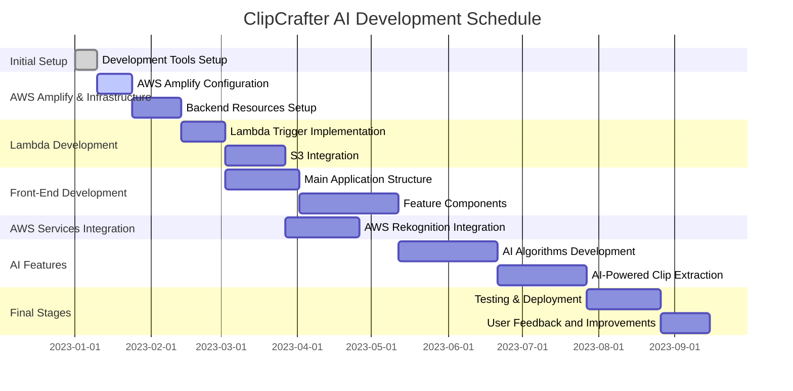
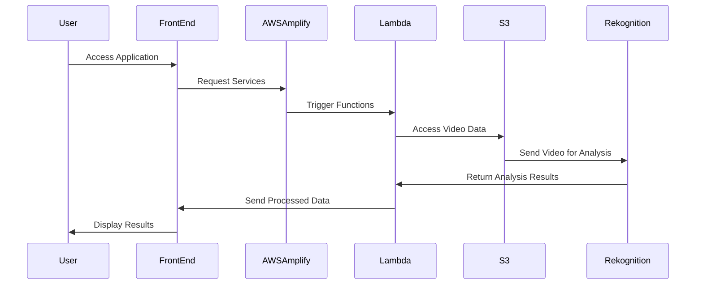

# 🎬 ClipCrafter AI

> _Unleash creativity and AI power in every clip!_

## 🏁 Introduction

> [!TIP]
> 👋 Welcome to ClipCrafter AI, where cutting-edge technology meets creativity in video editing.
>
> Our AI-driven platform is designed to revolutionize the way you create and share content. With ClipCrafter AI, transform long videos into captivating, short-form masterpieces with just a few clicks. Whether you're a content creator, marketer, or social media enthusiast, our intuitive tools make it easy to craft viral-worthy clips, perfect for platforms like TikTok, Instagram Reels, and YouTube Shorts.
>
> Unleash the power of AI to detect and highlight the most engaging parts of your videos, ensuring every clip starts with a punch. Our advanced facial tracking technology keeps your subjects in sharp focus, while our automated subtitles and captions add a new layer of engagement to your content. With ClipCrafter AI, tedious editing tasks are a thing of the past. Dive into a world where video creation is not only simple but also a delightful experience. It's time to craft, clip, and captivate with ClipCrafter AI!

---

## 🎯 Targeted high-value features

1. 🎥 **AI-Driven Video Editing (20%)** [8]

   - Auto-generate short-form videos (10%) [7]
   - Edit videos for enhanced engagement (10%) [8]

2. 🔍 **AI Clip Selection (18%)** [7]

   - AI identifies key segments in videos (9%) [7]
   - Continuous learning for clip selection improvement (9%) [7]

3. 🧔 **Facial Focus Technology (15%)** [6]

   - Advanced facial tracking for focused content (7.5%) [6]
   - Ideal for speaker/influencer-centric videos (7.5%) [6]

4. 📹 **AI-driven Video Generation (15%)** [8]

   - Generate engaging video snippets (7.5%) [8]
   - Potential for viral content creation (7.5%) [8]

5. 🎬 **Generative AI for Video Repurposing (14%)** [7]

   - Convert long videos into engaging shorts (7%) [7]
   - AI-driven content adaptation for various formats (7%) [7]

6. 📝 **Smart Subtitles & Captions (12%)** [5]

   - Automated subtitle generation (6%) [5]
   - Animated captions for increased engagement (6%) [5]

7. 🎯 **Punchline Score (10%)** [6]

   - AI detects compelling punchlines (5%) [6]
   - Enhances viewer engagement and content value (5%) [6]

### Low-value features

8. 🔄 **AI Feedback Loop (9%)** [7]

   - AI improves highlight recommendations (4.5%) [7]
   - Adapts to viewer preferences and trends (4.5%) [7]

9. 🎧 **Enhanced Audio-Video Sync (10%)** [5]

   - Advanced audio editing features (5%) [5]
   - Seamless synchronization with video (5%) [5]

10. 💬 **Responsive Captions & Layout (8%)** [6]

    - Dynamic captions for diverse content (4%) [6]
    - AI-driven layout for optimal viewing (4%) [6]

11. 🔄 **YouTube Link Conversion (8%)** [6]

    - Converts YouTube content for social media (4%) [6]
    - Streamlines content sharing across platforms (4%) [6]

12. 📊 **Content Performance Analytics (10%)** [7]

    - Track viewer engagement and metrics (5%) [7]
    - Optimize content based on analytics insights (5%) [7]

13. 🌍 **Global Audience Reach (9%)** [7]

    - Localization features for global audience (4.5%) [7]
    - Multi-language support for wider accessibility (4.5%) [7]

14. 🔄 **Cross-Platform Sharing (7%)** [5]

    - Easy sharing on social media platforms (3.5%) [5]
    - Supports multiple video formats and aspect ratios (3.5%) [5]

15. 🤖 **Automated Content Moderation (8%)** [7]

    - AI-driven moderation for content quality (4%) [7]
    - Ensure compliance with platform guidelines (4%) [7]

16. 🎨 **Creative Editing Tools (7%)** [6]

    - Wide range of creative editing options (3.5%) [6]
    - User-friendly interface for non-professionals (3.5%) [6]

17. 🌐 **Multi-Platform Streaming (6%)** [6]

    - Stream to various platforms with custom branding (3%) [6]
    - Audience participation and interaction features (3%) [6]

18. 📈 **SEO Optimization for Videos (6%)** [6]

    - Enhance video discoverability on search engines (3%) [6]
    - Tools for optimizing video titles, descriptions, and tags (3%) [6]

19. 📝 **Video Transcription Tools (5%)** [4]

    - Transcribe video content for repurposing (2.5%) [4]
    - Convert content into different formats (2.5%) [4]

20. 🌟 **Unlimited High-Quality Exports (5%)** [4]
    - High-quality video exports (2.5%) [4]
    - No limit on the number of exports (2.5%) [4]

This list now includes a core for each feature, providing insight into the complexity of implementation for each aspect of the product.

---

## 🛣️ Roadmap & milestones

### Diagram

---

## 📋 Task lists

### Global task list

1. **Initial Setup and Development Tools**

   - [x] Set up the Next.js environment for front-end development.
   - [x] Configure TypeScript for Lambda code.
   - [x] Set up ESLint for code analysis.
   - [x] Establish GitHub workflows for code quality checks.

2. **AWS Amplify and Infrastructure**

   - [x] Initial configuration of AWS Amplify for the project.
   - [x] Configure backend resources with Amplify (API, Auth, Storage).
   - [x] Set up automatic multi-region S3 bucket replication to handle the London region for Rekognition.

3. **Lambda Development and S3 Integration**

   - [x] Implement automatic Lambda trigger on S3 file upload.
   - [x] Develop the `download` function in S3 with progress information.
   - [x] Create FFmpeg commands with batch processing for optimization.
   - [x] Utilize `ffmpeg concatList.txt` for video concatenation.
   - [x] Implement `StatusUploader` for managing operation statuses.
   - [x] Configure AWS SAM for running Lambda locally with Docker during development.

4. **Front-End Development**

   - [x] Develop the main application structure (`Main.tsx`, `layout.tsx`, `page.tsx`).
   - [x] Implement global styles (`globals.css`).
   - [x] Develop feature components (`Features.tsx`).
   - [x] Use Amplify UI React library for user interface.

5. **AWS Services Integration**

   - [x] Integrate AWS Rekognition for video analysis.
   - [x] Use `ffmpeg getCmd` with blurred background for video processing.

6. **Specific Feature Development**

   - [ ] Set up AWS Transcribe for automatic transcription.
   - [ ] Use AWS Comprehend to analyze transcribed text.
   - [ ] Transition from Lambda FFmpeg Layer to AWS MediaConvert Jobs.
   - [ ] Embed generated subtitles into the video using AWS MediaConvert.
   - [ ] Design an AWS Step Functions workflow to automate the process.

7. **🎥 AI-Driven Video Generation and Editing**

   - [ ] Develop AI algorithms for automatic video generation and editing.
   - [ ] Create functionality to transform long-form videos into short clips for social media platforms.

8. **🔍 AI-Powered Clip Extraction**

   - [ ] Implement AI techniques for identifying and extracting key segments from longer videos.
   - [ ] Set up an AI feedback loop for improved clip selection.

9. **🧔 Facial Tracking and Center Stage Focus**

   - [ ] Develop facial tracking technology for content focusing on speakers or influencers.

10. **📝 Automated Subtitles and Captions**

    - [ ] Integrate automated and animated subtitles and captions.

11. **🎧 Advanced Audio and Video Editing Features**

    - [ ] Implement advanced audio editing and synchronization features.
    - [ ] Develop an intuitive interface for video trimming, clipping, and editing.

12. **💬 Dynamic Captions and AI-Relayout**

    - [ ] Create dynamic captions responsive to video content.
    - [ ] Implement AI-relayout for optimal viewing on different platforms.

13. **🔄 Multi-Platform Compatibility and Sharing**

    - [ ] Ensure easy sharing of videos across various social media platforms.
    - [ ] Support multiple video formats and aspect ratios.

14. **📝 Transcription and Repurposing Tools**

    - [ ] Develop tools for video content transcription and repurposing.

15. **Testing, Deployment, and Monitoring**

    - [ ] Conduct comprehensive testing of the entire pipeline.
    - [ ] Adjust configurations based on test results for optimal performance.
    - [ ] Deploy the solution in a production environment.
    - [ ] Set up system performance monitoring and alerts.

16. **Improvements and Maintenance**

    - [ ] Implement analytics to measure the effectiveness of video processing.
    - [ ] Continuously improve the system based on user feedback and analytics data.

17. **Ongoing and Upcoming Developments**
    - [ ] (In progress) Integrate Stripe for payments.
    - [ ] (To do) Create documentation for the system and its components.
    - [ ] (To do) Train team members or end-users on how to use the system effectively.
    - [ ] Integrate AWS Rekognition's segment detection API into your video processing pipeline.
    - [ ] Develop a system to parse and interpret the output from Rekognition for identifying key video segments.
    - [ ] Automate the video editing process based on the segments identified by Rekognition.
    - [ ] Test and optimize the integration for accuracy and efficiency.

This list includes the tasks necessary to develop the new AI-driven video editing features, ensuring a comprehensive approach to building a versatile and user-friendly video editing platform.

  
### Backend-specific task list

1. 📤 **StatusUploader.ts**

   - [x] Implement basic structure of `StatusUploader` class.
   - [ ] Review and optimize error handling in `StatusUploader` class.
   - [ ] Add unit tests for different scenarios (e.g., successful upload, failed upload).
   - [ ] Consider implementing a retry mechanism for failed S3 operations.
   - [ ] Document the class methods for better maintainability.

2. ⚙️ **config.ts**

   - [x] Define basic configuration structure.
   - [ ] Validate configuration values (e.g., check for valid region, thresholds).
   - [ ] Consider using environment variables for sensitive data.
   - [ ] Add comments to explain each configuration option.

3. 📄 **event.json**

   - [x] Create a basic event JSON structure for testing.
   - [ ] Create additional test event JSON files for different scenarios.
   - [ ] Validate the structure of the event in your Lambda function to handle malformed events.

4. 📊 **getData.ts**

   - [x] Extract data from Lambda S3 event.
   - [ ] Implement more robust error handling and logging.
   - [ ] Optimize the data extraction logic for efficiency.
   - [ ] Add comments to clarify the purpose of each step in the data extraction process.

5. 🚀 **index.ts**

   - [x] Set up the main Lambda handler function.
   - [ ] Refactor the handler for better readability and maintainability.
   - [ ] Implement more detailed logging for each step of the process.
   - [ ] Add error handling for each external call (e.g., S3, Rekognition).

6. 📝 **logger.ts**

   - [x] Create a basic logging function.
   - [ ] Extend the logger functionality to support different log levels (e.g., info, warn, error).
   - [ ] Implement a mechanism to toggle logging on/off based on environment variables.

7. 📈 **qlip-crop-model-out.json**

   - [x] Provide a sample output model JSON.
   - [ ] Validate the JSON structure to ensure it meets your application's requirements.
   - [ ] Consider moving model output data to a more secure storage if it contains sensitive information.

8. 👁️ **rekognition.ts**

   - [x] (Assuming) Basic AWS Rekognition integration.
   - [ ] Implement error handling and logging for AWS Rekognition calls.
   - [ ] Optimize Rekognition interactions for performance and cost.
   - [ ] Add unit tests for the Rekognition integration.

9. 🌐 **s3.ts**

   - [x] Implement basic S3 upload and download functions.
   - [ ] Implement more comprehensive error handling for S3 operations.
   - [ ] Optimize file upload/download methods for large files.
   - [ ] Add functionality to handle different S3 event types.

10. ✅ **getData.test.ts**

    - [x] Basic unit tests for `getData` function.
    - [ ] Add more test cases covering edge cases and error scenarios.
    - [ ] Implement mock objects for S3 to test without AWS dependencies.
    - [ ] Review and improve the assertions for better test coverage.

11. 🎥 **video.test.ts**

    - [x] (Assuming) Basic structure for video processing tests.
    - [ ] Write unit tests for video processing logic.
    - [ ] Mock external dependencies (e.g., file system, AWS services) in tests.
    - [ ] Ensure tests cover both successful and failure scenarios.

12. 🧩 **types.ts**, **utils.ts**, **video.ts**
    - [x] Basic types, utility functions, and video processing logic.
    - [ ] For `types.ts`: Document each type/interface for clarity.
    - [ ] For `utils.ts`: Add error handling in utility functions.
    - [ ] For `video.ts`: Optimize video processing functions for performance.
    - [ ] Add unit tests for utility functions and video processing logic.

## 🆓 Cloud Service Providers Free Tier Overview

### AWS Free Tier

- **Transcribe**: 60 minutes per month for 12 months.
- **Amplify**: 1,000 build & deploy minutes per month; 5GB hosting, and 15GB outbound data transfer per month.
- **Rekognition**: 5,000 images per month or 1,000 minutes of video processed per month for 12 months.
- **MediaConvert**: 20 minutes of video conversion per month.
- **Comprehend**: 50K units of text (5M characters) for text analysis per month for 12 months.
- **Lambda**: 1 million free requests and 400,000 GB-seconds of compute time per month.
- **S3**: 5GB of standard storage, 20,000 GET requests, and 2,000 PUT requests per month for 12 months.
- **AMPLIFY STUDIO**: Included in the Amplify Free Tier.
- **AMPLIFY CLI**: Free to use, costs depend on the AWS resources used.
- **AMPLIFY LIBRARIES**: Free to use, costs depend on the AWS resources used.
- **API Gateway**: 1 million API calls per month for 12 months.
- **AppSync**: 250K queries per month and 250K real-time data records per month for 12 months.
- **CloudFront**: 50GB data out and 2,000,000 HTTP or HTTPS requests per month for 12 months.
- **Cognito**: 50,000 active users per month for Amazon Cognito User Pools.
- **DynamoDB**: 25GB of storage, 25 read capacity units, and 25 write capacity units; 2.5 million stream read requests per month for 12 months.
- **Elasticsearch**: 750 hours of t2.small.elasticsearch instance per month for 12 months.
- **Kinesis**: 1 shard of Kinesis Data Stream for 12 months.
- **Lex**: 10,000 text requests or 5,000 voice requests per month for 12 months.
- **Location Service**: 25,000 map requests per month and 25,000 positioning requests per month for 12 months.
- **Pinpoint**: 5,000 targeted users per month; 1M push notifications.

## ClipCrafter AI Alternatives

  
### Alternatives

### Klap.app

- **AI-driven Video Generation:** Creates engaging snippets from videos, potentially viral
- **AI-powered Video Editing:** Automatically generates TikToks, Reels, and Shorts from long-form YouTube content
- **YouTube Link Conversion:** Converts YouTube videos into short-form videos for social platforms

### Qlip.ai

- **Punchline Score:** AI detects compelling punchlines within the video
- **AI Feedback Loop:** Improves highlight recommendations over time
- **AI-Powered Clipping:** Extracts short clips from long videos

### Vizard.ai

- **Transcription and Editing:** Streamlines video content creation and repurposing
- **Automated Video Editing:** Simplifies the video editing process
- **Audio Editing and Sync:** Advanced audio editing features and seamless syncing with visuals

### 2short.ai

- **Captivating Facial Tracking:** Keeps the subject at the center with facial tracking
- **Effortless Animated Subtitles:** Adds animated subtitles to videos
- **Automated Clip Generation:** Extracts engaging segments from longer videos

### Opus.pro

- **Generative AI for Video Repurposing:** Converts long videos into shorts
- **Dynamic Captions and AI-Relayout:** Offers features like dynamic captions for enhanced viewer engagement
- **Multi-Platform Streaming:** Facilitates streaming to various platforms with custom branding and audience participation

## 📇 Contact

For any inquiries or feedback, contact me [Alex Lévy](mailto:alexlevy0@gmail.com).
Thank you for checking out ClipCrafter AI!
